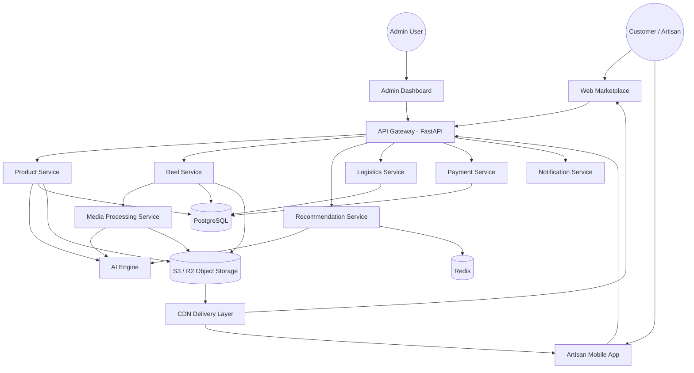

# CraftBridge System Design

## 1. System Overview
CraftBridge is an AI-powered craft marketplace that helps rural artisans digitize and sell handmade products to customers through web and mobile channels. The platform combines catalog commerce, short-form video discovery, AI-assisted content creation, and logistics orchestration in a single ecosystem.

Primary platform goals:
- Help artisans publish products and media quickly with AI assistance.
- Improve customer discovery through story-based feeds and recommendations.
- Provide trusted fulfillment, payment, and authenticity tracking.

## 2. Architecture Style
CraftBridge uses a microservices architecture behind a FastAPI API Gateway.

### Why this style
- Service independence: each domain service owns its data and release cycle.
- Scalability: high-traffic services (reels/media/recommendations) scale independently.
- Fault isolation: failures in one domain (for example media transcoding) do not fully block checkout or payments.

## 3. System Components And Service Boundaries
### Client Applications
- Web Marketplace (Next.js): customer-facing browsing, product details, checkout, and discovery feed experiences.
- Artisan Mobile App (React Native): offline-first upload, catalog management, reel posting, and order visibility for artisans.
- Admin Dashboard: moderation, analytics, compliance review, and operational controls.

### Platform Entry Point
- API Gateway (FastAPI): unified public API, auth enforcement, request routing, rate limiting, and response shaping.

### Domain Services
- Product Service: product catalog metadata, inventory attributes, and storefront-facing product retrieval.
- Reel Service: reel metadata, feed pagination, and engagement counters.
- Recommendation Service: candidate generation and ranking API for feeds and product suggestions.
- Media Processing Service: image enhancement, video transcoding, compression, and thumbnail generation orchestration.
- Logistics Service: shipment creation, route records, tracking status, and courier integrations.
- Payment Service: payment intent lifecycle, transaction status, escrow/payout coordination.
- Notification Service: event-based messaging via push, email, and SMS.
- AI Engine: model inference and training pipelines for listing generation, image enhancement, and recommendation models.

### Data And Infrastructure Components
- PostgreSQL: system-of-record relational data (users, artisans, products, orders, payments).
- Redis: caching, ephemeral feed/session data, and asynchronous task coordination.
- Object Storage (S3/R2): durable media assets (images/videos/thumbnails).
- CDN: low-latency media delivery for customer and artisan clients.

## 4. Architecture Diagram

## 5. End-To-End Data Flow
Artisan Upload -> AI Processing -> Storefront -> Discovery Feed -> Purchase -> Logistics

1. Artisan Upload: an artisan uploads product images and optional reel videos from the mobile app.
2. AI Processing: media assets are processed by Media Service and AI Engine (enhancement + listing generation draft).
3. Storefront: Product Service stores curated listing data and exposes storefront payloads via API Gateway.
4. Discovery Feed: Reel Service + Recommendation Service rank and return personalized feed content.
5. Purchase: customer places an order; Payment Service creates and confirms transaction state.
6. Logistics: Logistics Service creates route/tracking records and emits updates to Notification Service.

## 6. Architecture Principles
- Service isolation: every service owns domain logic and persistence boundaries.
- Event-driven workflows: asynchronous domain events trigger downstream processing (media, notifications, recommendations).
- Stateless services: API and worker workloads remain stateless; state is externalized to databases, caches, and object storage.
- Horizontal scaling: services scale by replicas based on throughput and queue depth.
- CDN-based media delivery: images and reels are served through CDN-backed object storage for global low-latency access.
