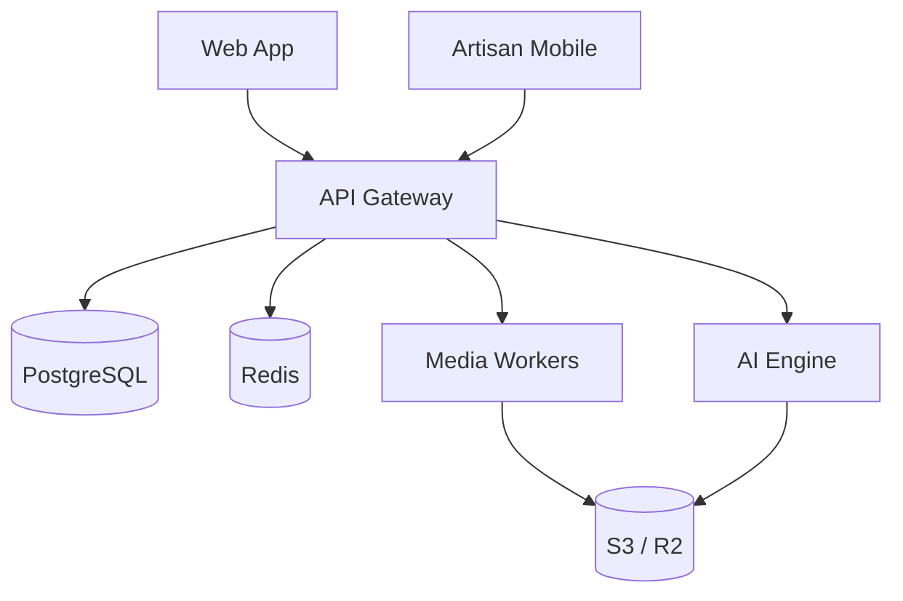

# ShilpSetu Deployment Guide (Phase 1)

## 1. Local Development Setup
This phase is documentation-first and architecture-first. Local setup is focused on running platform dependencies and service shells for integration planning.

### Prerequisites
- Docker Engine 24+
- Docker Compose v2+
- Node.js 20+ (for JS/TS apps)
- Python 3.11+ (for Python services/scripts)

### Quick Start
1. Clone repository and move to project root.
2. Create local environment variables (`.env`) for database, redis, storage, and service ports.
3. Start local stack with Docker Compose.

Example command:
```bash
docker compose up --build
```

### Docker Compose Architecture
Local compose topology includes:
- `web`: Next.js frontend (marketplace UI).
- `api-gateway`: FastAPI ingress and route aggregator.
- `postgres`: relational system of record.
- `redis`: caching and queue/state coordination.
- `ai-engine`: model inference API container.
- `media-workers`: asynchronous image/video processing worker container.

Recommended runtime flow:
- Browser clients call `web` on port `3000`.
- `web` calls `api-gateway` on port `8000`.
- `api-gateway` talks to domain services and persistence layers.
- `media-workers` and `ai-engine` handle asynchronous processing.



## 2. Production Deployment (Kubernetes)
Production runs on Kubernetes with separated workloads for API traffic, background workers, and GPU-enabled AI tasks.

### Cluster Topology
- API pods:
  - API Gateway deployment with horizontal pod autoscaling.
  - Stateless pods behind an ingress controller/load balancer.
- Worker nodes:
  - Media workers, recommendation workers, notification workers.
  - CPU-optimized autoscaling node pools.
- GPU nodes:
  - AI inference/training workloads requiring CUDA acceleration.
  - Dedicated node pool with taints/tolerations for GPU jobs only.

### Kubernetes Components
- Deployments:
  - `api-gateway`
  - `media-workers`
  - `ai-engine-inference`
- Stateful/managed dependencies:
  - PostgreSQL (managed service or StatefulSet depending on environment policy)
  - Redis (managed service or HA chart)
- Networking:
  - Ingress + TLS termination
  - Internal service-to-service networking
- Scaling:
  - HPA for API and worker deployments
  - Cluster autoscaler for worker and GPU node pools

## 3. Storage Strategy
Object storage (S3/R2 compatible) is the media source of truth.

### Stored Assets
- Product images:
  - originals
  - enhanced variants
  - thumbnails
- Reel videos:
  - raw uploads
  - transcoded renditions
  - poster frames/thumbnails

### Delivery
- All media is served through a CDN layer.
- Signed URLs are used for protected/private media operations.
- Lifecycle policies move stale media to lower-cost tiers where applicable.

## 4. Operational Baseline
- Centralized logs for all pods and workers.
- Metrics and tracing for API latency, worker queue depth, and model inference latency.
- Health checks:
  - liveness/readiness probes on API and worker containers.
- Rollout safety:
  - blue/green or canary rollout for model-serving workloads.
